# 🎓 Student Performance Prediction

This is a machine learning project to predict students' CGPA using a trained regression model. It allows data entry through a Streamlit interface and gives users performance predictions based on a variety of academic and personal input factors.
## ✅ Features

- Linear Regression and Random Forest model options
- User authentication (Sign up / Log in)
- Visual analytics (bar chart, pair plots, line/area plots)
- Prediction results with class category
- Error evaluation (MAE, MSE)
- Clean and interactive interface with Streamlit

---

## 🖼️ Screenshots

### 🔷 Home Page
A simple entry interface on Streamlit  
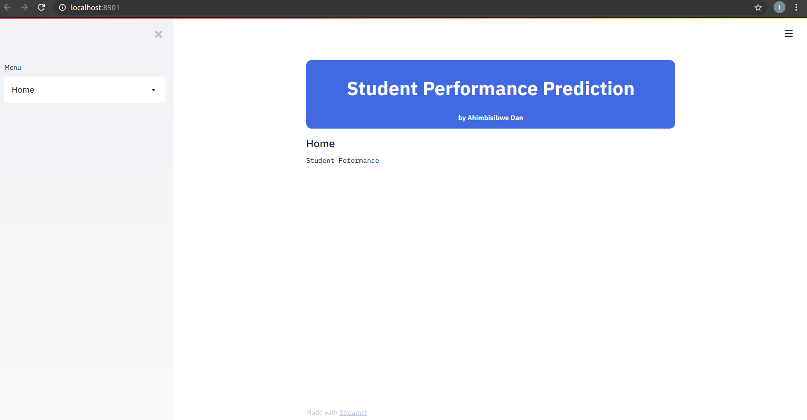

---

### 🔐 Authentication  
Login and signup options  
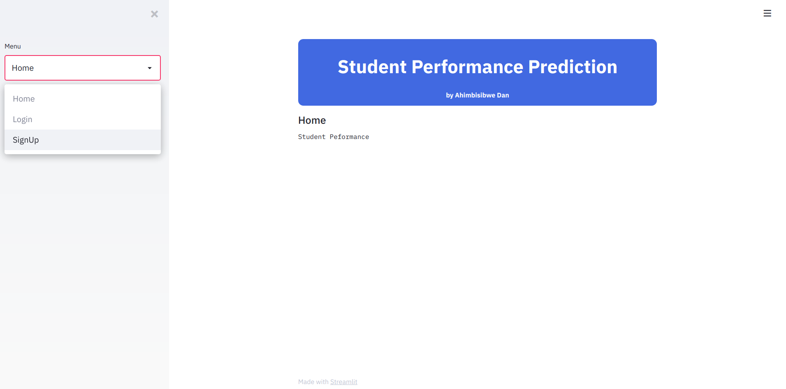  
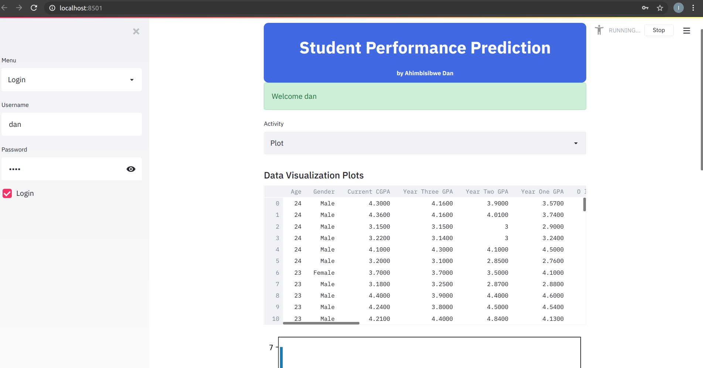

---

### 📊 Dashboard with Dataset View  
Browse raw GPA and background data  
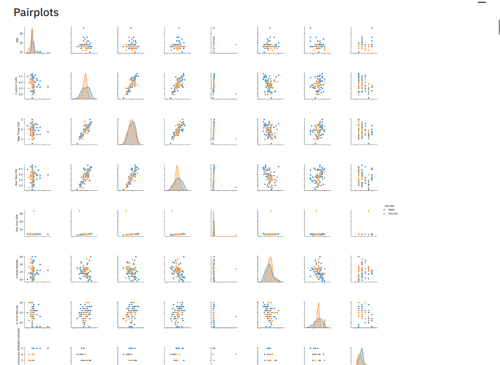

---

### 📉 Pairplots and Distributions  
Relationships between various features  
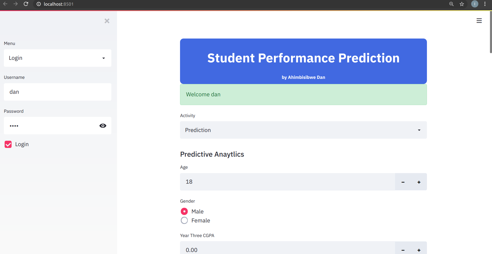

---

### 📝 Input Form for Prediction  
Users enter academic and personal data  
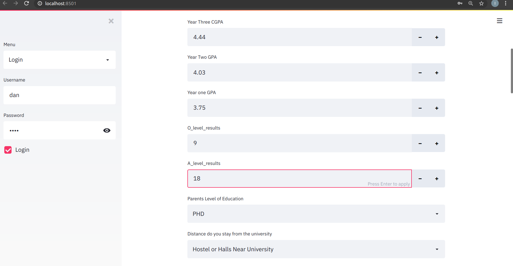  
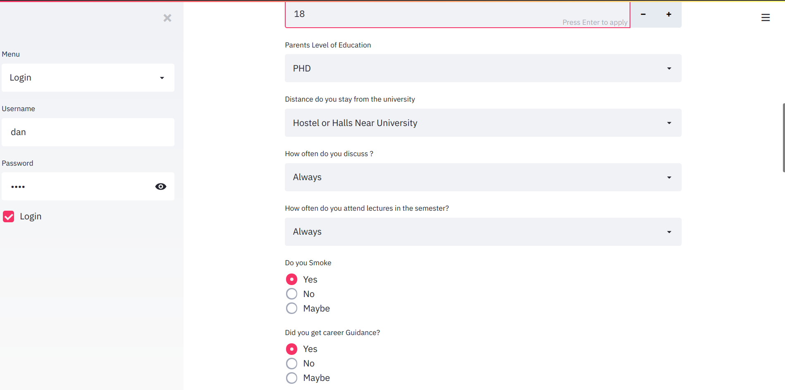  
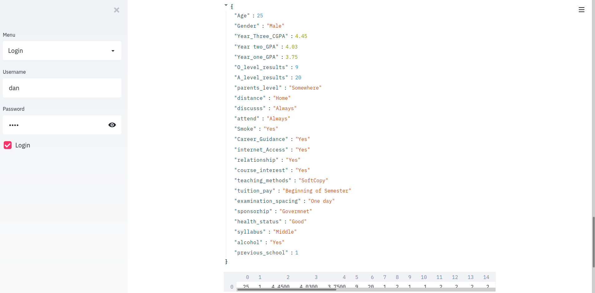

---

### 📋 Output Prediction  
Final CGPA prediction with interpretation  
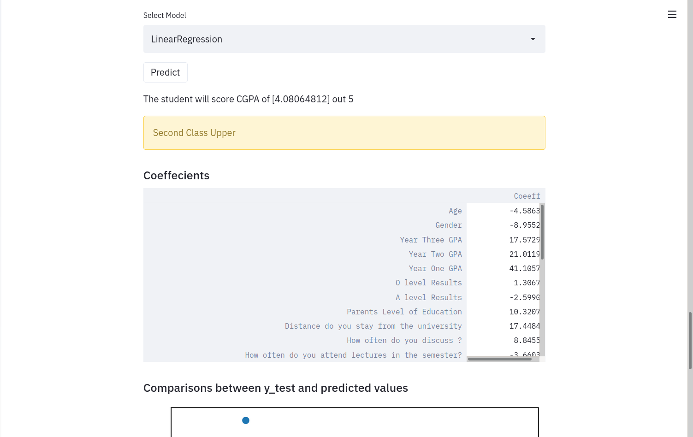  
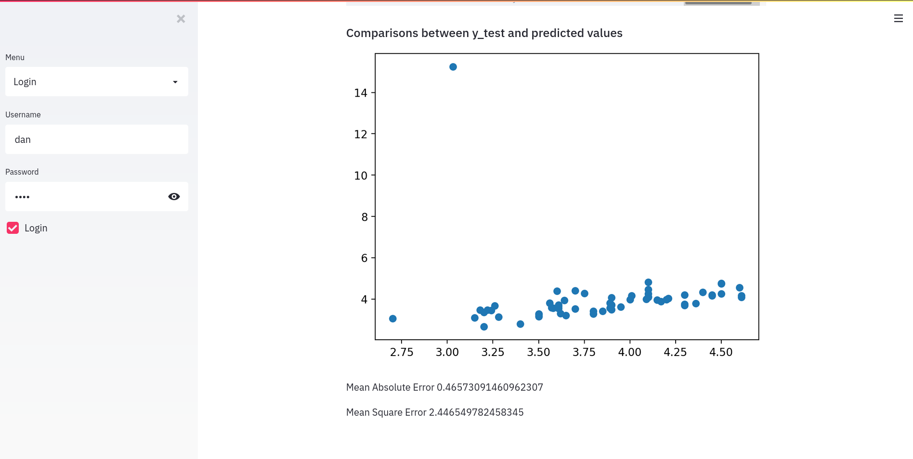

---

### 📈 Additional Visualizations  
Bar chart of CGPA distribution  
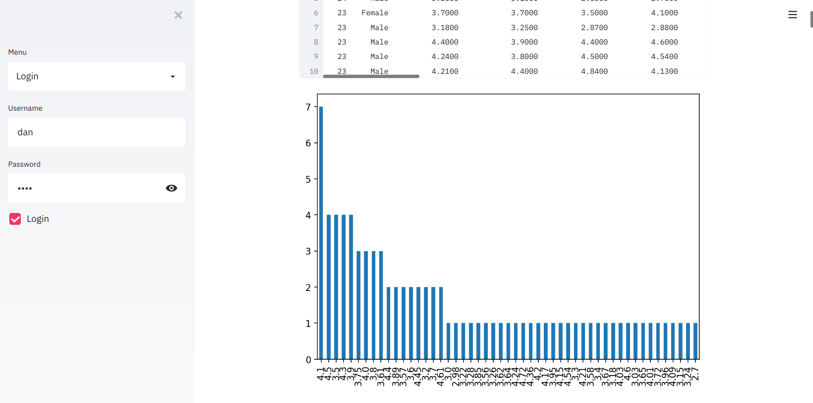

Area chart showing multiple variable trends  
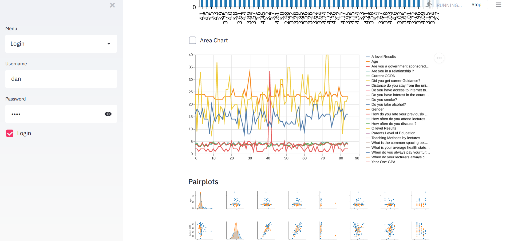

---

### 🧠 Core Logic & Model Code

#### Model Imports & Setup  
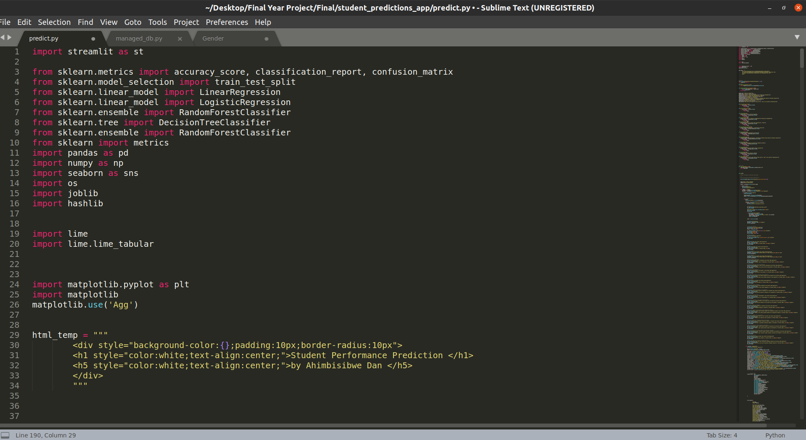

#### Feature Dictionaries  
Used to map text input to numeric values  
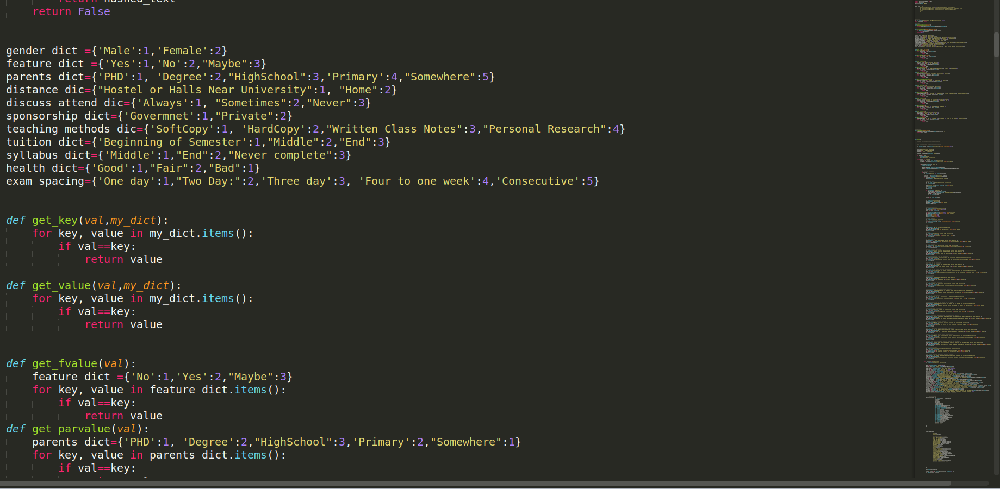

#### Prediction Input Section  
Streamlit form that captures prediction inputs  
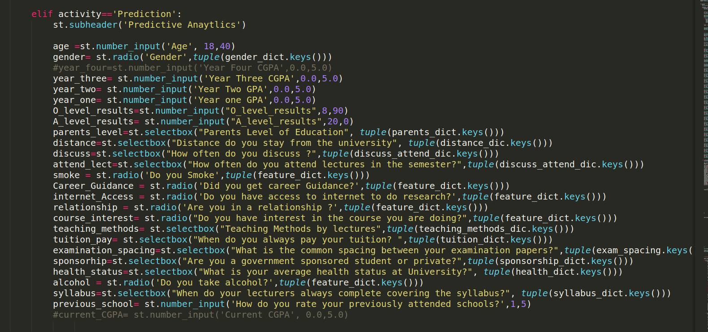

#### Random Forest Prediction Logic  
Model training, evaluation, and output  
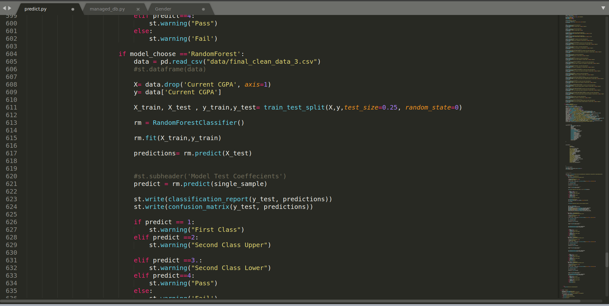

#### User Login System Using SQLite  
Authentication backend  
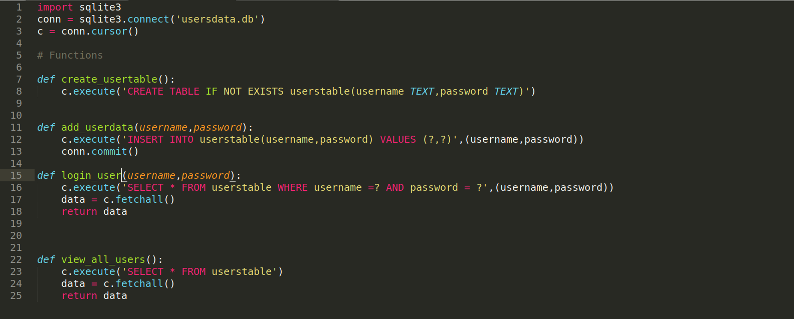

---

## ⚙️ Tech Stack

- **Frontend**: Streamlit
- **Backend**: Python (scikit-learn, pandas, SQLite)
- **Models**: Linear Regression, Random Forest Classifier
- **Visualization**: Matplotlib, Seaborn

---

## 🧪 Model Details

- **Inputs**: GPA from previous years, exam results, personal habits, access to resources, etc.
- **Output**: Predicted CGPA (out of 5.0)
- **Target Label Classes**:
  - First Class
  - Second Class Upper
  - Second Class Lower
  - Pass
  - Fail

---

### 📌 Conclusion
This was my first machine learning project. I improved it bit by bit. I plan to share more updates and refinements soon.

